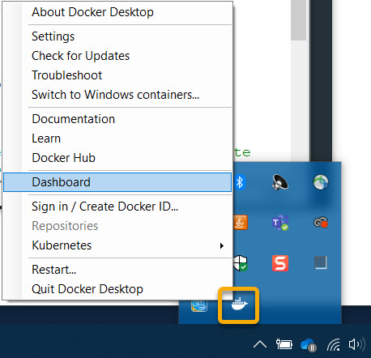

# julia-jupyter-playground
In this repository we explore programming in Julia. It is intended to be used for training purposes and to act as a set of example scripts that you can run. To make these examples self-documenting we are using Jupyter notebooks as a way of mixing descriptive text and the executable code. Jupyter notebook runs as a web server and you access it from your web browser. Jupyter notebooks are good for simple scripting requirements however for large projects we would expect that you would script Julia with standalone scripts. As such consider this repo as an introduction to the language, not about all the ways you can deploy and run Julia.

## Installation and setup
To allow you to run this on your local machine, without any dependencies on an external web server, we are using [Docker](https://www.docker.com/). Docker allows you to run the package of software needed to run Jupyter with Julia preinstalled (it also preinstalls some of the Julia packages). Docker allows a set of software to be bundled up as a single package and it is typically used to run a bunch of software packaged with a small Linux operating system. This package is called a Docker container. Users can then run the Docker container without having to deal with all the complex installation of the software.

1. Install Git so you can clone this repository to your machine. On windows I recommend would use [GitHub Desktop](https://desktop.github.com/). 
2. Install [Docker](https://docs.docker.com/get-docker/) on your machine.
3. Run the ```1. Build-docker-container-Linux.sh``` or ```1. Build-docker-container-Win.bat``` depending on your platform. The Linux script will probably also work on Mac, but this is untested. This script will build the Docker container, based on the specification in the 'Dockerfile', downloading all the required software. This will require approximately a 1.2 GB download the first time you do this. This creates the 'datascience' docker container that is then called from the startup script. This Docker container includes R, Python and Julia running in the Jupyter notebook environment. 
4. Run ```2. Start-datascience-notebook-Linux.sh``` or ```2. Start-datascience-notebook-Windows.bat``` depending on your platform. This will start the 'datascience' Docker container created in step 1.
5. You access the Jupyter notebook using your web browser. It then connects to the Jupyter webserver running in the Docker container. To access the Jupyter site from local host you will need a link to where it is running. This link includes a security key that changes each time it starts. As a result the link can change. The first time you run the Start script it will list this link in the script output. It will look something like: 
    ```
    http://127.0.0.1:8888/?token=6f15d26cbb55b45fc59e0d3b58ada954f8e2bf8138c66846
    ```
6. Open the link in your web browser. If you are successful you will see Jupyter start and it will show you:
.
You will find all the scripts in the work/notebooks folder.

### Finding the Notebook link for an already running docker container.
Once your Docker container is running you can safely close the command line terminal that was used to start it. This will not stop the running container. If you now need to find the URL to the Jupyter notebook again you can find it in the container logs which are available through the Docker dashboard. On Windows right click on the Docker Desktop and open the Dashboard.



Click on the jupyter/datascience-notebook:julia-1.5.0 container then you will see the logs and the link needed to view the notebook.


## Reusing this notebook setup for your own scripts
If you want to use the structure and setup for your own scripting purposes it is probably best that you don't just add scripts to this Git repo. To make your own.
1. Create an empty Git repo on Github, then clone this repo to your local machine. I create them on Github first instead of locally as it sets up the link to Github without needed to do extra work. If you create it locally you can later set it up in Github.
2. Copy over the build and start scripts (1. Build-docker-container-Linux.sh, 1. Build-docker-container-Win.bat, 3. Start-datascience-notebook-Linux.sh, 2. Start-datascience-notebook-Win) and Dockerfile.
4. Make sure you have Docker installed then use the scripts to setup and start your own Jupyter notebook.
5. Make sure your .gitignore file contains entries to ignore the files generated by Jupyter.
```
# Ignore Jupyter temporary files
.ipynb_checkpoints
*/.ipynb_checkpoints/*
```

## Troubleshooting
Here are some potential problems that you might have and ways to resolve them.
### Running Start script fails with "Bind for 0.0.0.0:8888 failed: port is already allocated" error
This indicates that your docker container is already running and so it couldn't start a second container. To check if the container is running go to the Docker dashboard and from there you can see the container logs for the link to your running notebook, see the section on 'Finding the Notebook link for an already running docker container' for more information.
